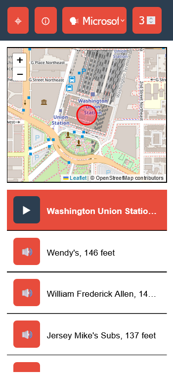

# Soundscape Web Client

The Soundscape web client provides a Soundscape-like experience by announcing nearby points of interest and intersections and playing audio beacons, all with spatial audio.

Try it for yourself! https://soundscape-community.github.io/soundscape-web-client/



This project aims to make both the user and developer communities for Soundscape more inclusive:
1. Unlike the original iPhone app, users do not need an iOS device. By running in a browser, the Soundscape web client works on any platform. You can use it not just on iPhone, but also Android, and even Windows.
2. Developers do not need a Mac or comfort with Xcode to contribute. Web technologies are approachable and  familiar to many developers who are interested in improving the software.

## Contributing

Help is welcome! Please see the [issue board](https://github.com/soundscape-community/soundscape-web-client/issues) for items that need attention, and below for some tools to aid in development and debugging.

### Activity simulator


Select a local GPX file from your computer, and it will be replayed on a visual map with audio callouts.

https://soundscape-community.github.io/soundscape-web-client/replay_gpx.html

### Location override
To use a location other than what's reported by your device, include the latitude, longitude, and compass heading (degrees from north) in the URL, e.g. https://soundscape-community.github.io/soundscape-web-client/?lon=-77.006156&lat=38.897600&heading=0.0 will place you near Union Station in Washington, D.C.

### Running the app on your own machine
1. Install the Python dependencies, and run the tile server proxy.
    ```
    $ cd server
    $ python -m venv env
    $ . env/bin/activate
    $ pip install -r requirements.txt
    $ python tile_server_proxy.py
    ```
2. Run a web server, such as live-server, in the working directory. Make sure you specify a port that doesn't conflict with the tile server proxy.
    ```
    $ npm install live-server
    $ live-server --port=8081 .
    ```

## Third-party libraries used
1. [Turf.js](https://turfjs.org/) (for GeoJSON processingand geospatial calculations)
2. [Leaflet](https://leafletjs.com/) (provides OpenStreetMap widget)
3. [unmute](https://github.com/swevans/unmute) (improved web audio behavior on iOS)
